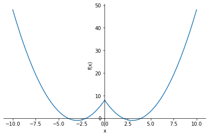

# Домашнее задание 
f(x) =(sin(x)/2 + cos(x)/2)2 * sin(x) - это для тех, кто хочет сложное уравнение
f(x) = x2 - 6*abs(x) + 8 - это полегче.

- Определить корни
- Найти интервалы, на которых функция возрастает
- Найти интервалы, на которых функция убывает
- Построить график
- Вычислить вершину
- Определить промежутки, на котором f > 0
- Определить промежутки, на котором f < 0


```python
from sympy import *

x = Symbol('x', real=True)
f = x**2 - 6 * abs(x) + 8
f1 = x**2 - 6 * (-x) + 8
f2 = x**2 - 6 * x + 8
```


```python
p1 = plot(f)
```


    

    


```python
f_roots = solve(f1)+solve(f2)
pprint(f'Корни урованения f(x)={f} -> {f_roots}')
```

    Корни урованения f(x)=x**2 - 6*Abs(x) + 8 -> [-4, -2, 2, 4]
    


```python
extrems = solve(diff(f1)) + solve(diff(f2))
extrems.append(0)
extrems.sort()
fx = lambdify(x,f)
list_grh_vrt=[]
for i in extrems:
    list_grh_vrt.append(fx(i))
list_grh_vrt = list(zip(extrems,list_grh_vrt))
pprint(f'Вершинами графика функции f(x)={f} являются точки:\n {list_grh_vrt}')
```

    Вершинами графика функции f(x)=x**2 - 6*Abs(x) + 8 являются точки:
                        [(-3, -1), (0, 8), (3, -1)]                   
    


```python
increasing_result =''
for i in range(0,len(extrems)+1):
    if i == 0:
        if extrems[i] <= 0: f_check = f1
        else: f_check = f2
        if is_increasing(f_check,Interval(-oo,extrems[i])):
            increasing_result += f'На промежутке {Interval(-oo,extrems[i])} функция возрастает\n\r'
        else:
            increasing_result += f'На промежутке {Interval(-oo,extrems[i])} функция убывает\n\r'
    elif i == len(extrems):
        if extrems[i-1] <= 0: f_check = f1
        else: f_check = f2
        if is_increasing(f_check,Interval(extrems[i-1],oo)):
            increasing_result += f'На промежутке {Interval(extrems[i-1],oo)} функция возрастает\n\r'
        else:
            increasing_result += f'На промежутке {Interval(extrems[i-1],oo)} функция убывает\n\r'
    else:
        if extrems[i] <= 0: f_check = f1
        else: f_check = f2
        if is_increasing(f_check,Interval(extrems[i-1],extrems[i])):
            increasing_result += f'На промежутке {Interval(extrems[i-1],extrems[i])} функция возрастает\n\r'
        else:
            increasing_result += f'На промежутке {Interval(extrems[i-1],extrems[i])} функция убывает\n\r'
pprint(increasing_result)
```

    На промежутке Interval(-oo, -3) функция убывает 
                                                    
    На промежутке Interval(-3, 0) функция возрастает
                                                    
      На промежутке Interval(0, 3) функция убывает  
                                                    
    На промежутке Interval(3, oo) функция возрастает
                                                    
    


```python
func_pos_neg_intervals = ''
for i in range(0,len(f_roots)):
    if i == 0:
        if fx((f_roots[i]+f_roots[i+1])/2) < 0:
            func_pos_neg_intervals += f'На промежутке {Interval(-oo,f_roots[i])} f > 0\n'
            func_pos_neg_intervals += f'На промежутке {Interval(f_roots[i],f_roots[i+1])} f < 0\n'
        else:
            func_pos_neg_intervals += f'На промежутке {Interval(-oo,f_roots[i])} f < 0\n'
            func_pos_neg_intervals += f'На промежутке {Interval(f_roots[i],f_roots[i+1])} f > 0\n'
    elif i == len(f_roots)-1:
        if fx((f_roots[i-1]+f_roots[i])/2) < 0:
            func_pos_neg_intervals += f'На промежутке {Interval(f_roots[i-1],f_roots[i])} f < 0\n'
            func_pos_neg_intervals += f'На промежутке {Interval(f_roots[i],oo)} f > 0\n'
        else:
            func_pos_neg_intervals += f'На промежутке {Interval(f_roots[i-1],f_roots[i])} f > 0\n'
            func_pos_neg_intervals += f'На промежутке {Interval(f_roots[i],oo)} f < 0\n'
    else:
        if fx((f_roots[i]+f_roots[i+1])/2) < 0:
            func_pos_neg_intervals += f'На промежутке {Interval(f_roots[i],f_roots[i+1])} f < 0\n'
        else:
            func_pos_neg_intervals += f'На промежутке {Interval(f_roots[i],f_roots[i+1])} f > 0\n'
pprint(func_pos_neg_intervals)
```

    На промежутке Interval(-oo, -4) f > 0
     На промежутке Interval(-4, -2) f < 0
     На промежутке Interval(-2, 2) f > 0 
      На промежутке Interval(2, 4) f < 0 
      На промежутке Interval(2, 4) f < 0 
     На промежутке Interval(4, oo) f > 0 
    


```python

```


```python

```


```python

```
